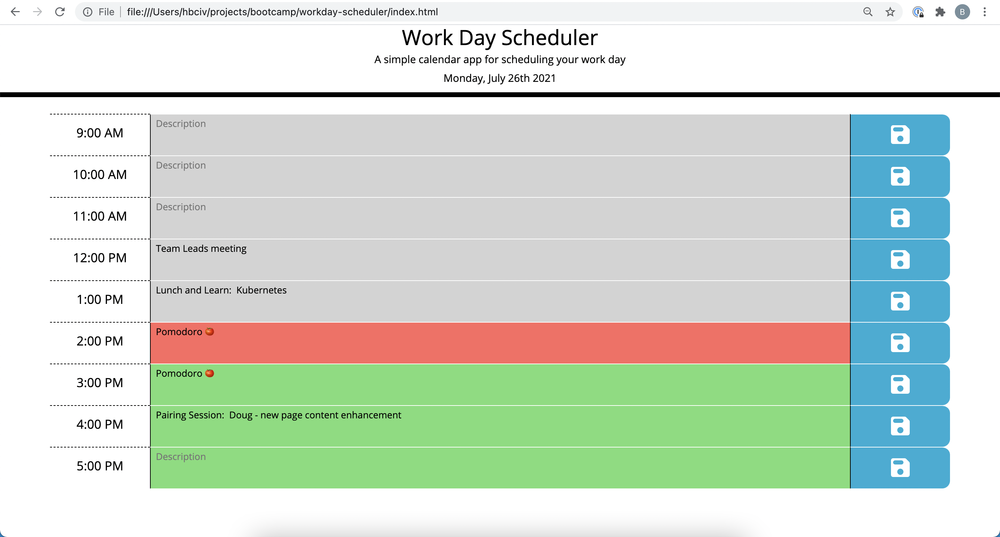
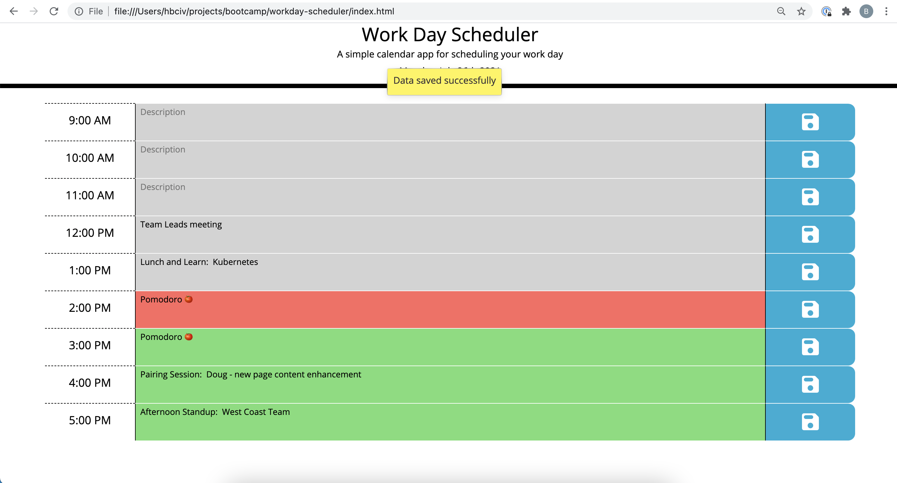

# About "Workday Planner"

## Background

The fifth homework assignment entails creating a simple, single-page day calendar for use in a workplace environment during business hours.  Users will open the application, click on an hour block and be able to enter text describing a task or a reminder.  After clicking the "Save" icon the text will be saved (local storage) so that it may be retrieved later.  Each row represents an hour and each row will be color-coded to correspond with the status of completion of the task in that hour.

  * Green = future event
  * Red = current event
  * Gray = past event

### Requirements

* All dates and times should be displayed to reflect the timezone, date and time of the user's machine at the time the application is used
* Each hour in the business day (09:00 AM through 5:00 PM) will be represented with an individual row
* Each hour will have:
  * A label for the hour in the business day
  * An input field to enter task information and notes
  * A button to save the input content to local storage
* User entered task content should be saved to local storage by clicking the "Save" button in it's respective row
* Previously saved task content should be displayed in the text field for the hour in which it was originally saved
* Existing saved content can be modified, saved and stored with the correct modifications made

## How to use

1. [Access page hosted on GitPages](https://monstertruckdog.github.io/workday-scheduler/)
2. Enter task information in the "Description" field within the row of the desired hour
3. Click blue disk icon on the far right side of the row to save the entered text
	* Previously saved content should already be dispalyed in it's respective hour row

## Usage

#### Display with existing saved content

#### Display with existing saved content, newly saved content and toast message feature

##Highlights and Features

* Simple click, enter, click save design
* Quick local storage display rendering
* All date and time values calculated with [MomentJS](https://momentjs.com/)
* User entered text content for each hour saved as it's own individual local storage item
	* Key value of stored item is it's respective clock hour for easy visibility and readibility within storage
* Input fields for user entered content use scrollable text area control type to allow for comprehensive note taking and formatting
* Toast message is displayed upon saving data entered to avoid user uncertainty that the save button was clicked or wasn't saved correctly

## Future Enhancements

* Add a "Save All" button option to save data in all rows at once to their respective local storage item
* Expand calendar from one day to five-day business week
* Add greater detail of tasks within each hour
     * Break each hour up into 30 or 15 minute blocks so that tasks are more easily separated within an hour*
* Add display text or visual notifications for holidays
* Incorporate a "share" mechanism to allow user to send day schedule to another party or colleague via email
    * Allow option of "shared" day schedule to be converted into a popular calendar format (example: `.ics`) 
* Include an option to integrate connectivity between calendar and the [Slack](https://slack.com/) message app to send the message content from the calendar to a user or channel on each the respective hour
* Include a background color transition gradient:
    * With each second or minute the hour approaches the next, the color of the hour transitions to a lighter (or darker) shade so that users might visually intuit an estimate of the remaining minutes within the hour without looking at a clock

## Application Access

* **GitHub Repository**:  [monstertruckdog/workday-scheduler](https://github.com/monstertruckdog/workday-scheduler)
* **Deployed (*GitHub Pages*)**:  [workday-scheduler](https://monstertruckdog.github.io/workday-scheduler/)
